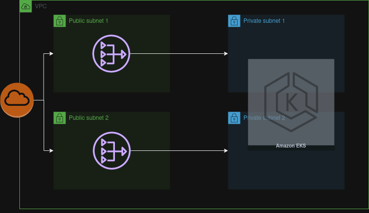
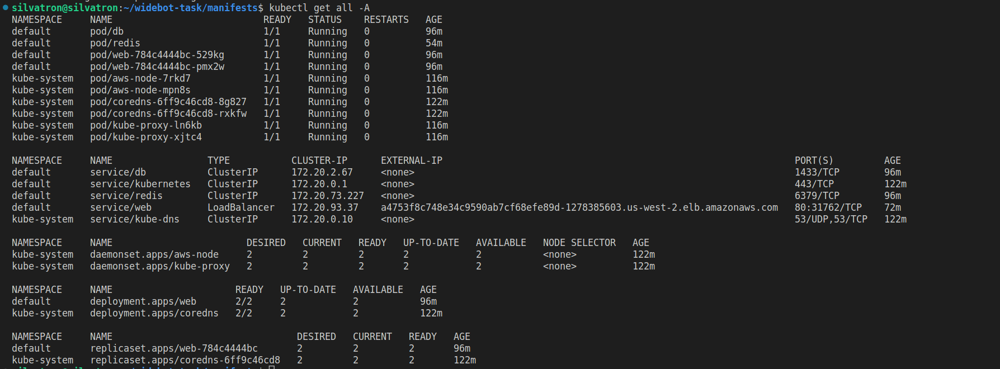

# Widebot Task
## High Level Design


## Project Info.

This project contains:
*  Infrastructure as code using [Terraform](https://www.terraform.io/) that builds an environment on the AWS cloud platform
* [Kubernetes](https://kubernetes.io) Manifests YAML files for deploying web-app, redis, sql-server
* Demo aspnetapp with Dockerfile and docker-compose file [git-repo](https://github.com/docker/awesome-compose/tree/master/aspnet-mssql)

## Task Over view

## Task
Provisioning Infrastructure as a code with terraform for Web Applications and Databases
(MongoDB, SQL Server) and Redis for caching, with Domain Name, Certificate, and Load
Balancer, Using docker and Kubernetes.
## Description
As a DevOps engineer, your task is to write a terraform template to provision the infrastructure
for a web application and its associated databases MongoDB, SQL Server, and Redis for
caching. Additionally, you will need to set up a domain name, SSL certificate, and load balancer
to ensure scalability and security. This task will test your skills in infrastructure provisioning,
database management, caching, networking, and security.
Application, databases and Redis will be each one as a dockers and use Kubernetes to let up a
replication controller to run pods that are accessed as services on Docker.
Application docker to use in the task:
https://github.com/docker/awesome-compose/tree/master/aspnet-mssql

## Tech Stack

* [Terraform](https://www.terraform.io/)
* [AWS](https://aws.amazon.com/)
* [Docker](https://www.docker.com/)
* [kubernetes](https://kubernetes.io)
* [redis](https://redis.io/)
* [sql-server](https://www.microsoft.com/en-us/sql-server)

## Configured The App to Utilize Redis 
**dbinstance.cs**
```
using System;
using Microsoft.AspNetCore;
using Microsoft.AspNetCore.Builder;
using Microsoft.AspNetCore.Hosting;
using aspnetapp;
using Microsoft.Extensions.Hosting;
using NRedisStack;
using NRedisStack.RedisStackCommands;
using StackExchange.Redis;

class DBinstance
{
    public static IDatabase CreateDBinstance(string[] args) {
        ConnectionMultiplexer redis = ConnectionMultiplexer.Connect(Environment.GetEnvironmentVariable("Databases"));
        IDatabase db = redis.GetDatabase();
        return db;
    }

}
``` 
**Dockerfile**

```
RUN dotnet add package NRedisStack
```

## Get Started

### Clone The Repo 
    ```
    git clone https://github.com/AmrTarek17/widebot-task.git
    ```
### Setup The Infra
* First setup your aws account with cli.

* Second build the infrastructure by running

    ```bash
    cd widebot-task/terraform
    ```

    ``` 
    terraform init
    terraform apply
    ```
    that will build:
    
    * VPC named "prod-vpc"
    * 2 public Subnets
    * 2 private Subnets
    * 2 nat gateway   
    * EKS private Kubernetes cluster


       

### Update Kubeconfig
    
```        
aws eks --region <region> update-kubeconfig --name <clusterName>
```
### Deploy manifests file

``` 
kubectl apply -f manifests/.
```


---


:tada: :tada: :tada: :tada:
